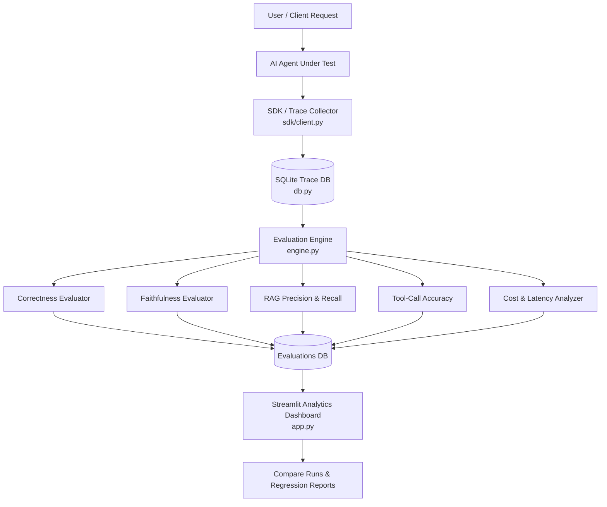

# 🤖 AI Agent Evaluation & Reliability Platform

[](https://github.com/VimalN2005/AI-Agent-Evaluation-Reliability-Platform/actions)
[](https://opensource.org/licenses/MIT)
[](https://www.python.org/)
[](https://streamlit.io/)
[](https://www.docker.com/)
[](https://github.com/VimalN2005/AI-Agent-Evaluation-Reliability-Platform/stargazers)

> **Production-grade platform to evaluate, monitor, compare, and benchmark AI Agents & GenAI applications** — detecting hallucinations, measuring RAG retrieval accuracy, validating tool calls, and tracking token cost & latency.

---

## 📌 Key Evaluation Pillars

| Pillar | Metric | Description |
|---|---|---|
| 🎯 **Correctness** | LLM-as-Judge & Semantic Match | Compares agent outputs against ground truth / expected answers. |
| 🛡️ **Faithfulness** | Hallucination Detection | Verifies whether the generated answer is strictly grounded in retrieved context. |
| 🔍 **RAG Quality** | Context Precision & Recall | Measures relevance of retrieved chunks and documents. |
| ⚡ **Tool-Call Accuracy** | Function Calling Validation | Evaluates whether the agent invoked the correct tool with expected arguments. |
| 💰 **Cost & Latency** | Token Usage & Runtime (ms) | Real-time monitoring of tokens, API cost ($), and response latency. |
| 🚨 **Safety Guardrails** | Rule-based & Prompt Safety | Automatically flags unsafe, abusive, or out-of-boundary outputs. |

---

## 🏗️ System Architecture



---

## 🚀 Quick Start

### Option 1: Run with Docker (Recommended)

```bash
# Clone the repository
git clone https://github.com/VimalN2005/AI-Agent-Evaluation-Reliability-Platform.git
cd AI-Agent-Evaluation-Reliability-Platform

# Run using Docker Compose
docker compose up -d
```
Open [http://localhost:8501](http://localhost:8501) in your browser!

---

### Option 2: Run Locally with Python

```bash
# 1. Clone repository
git clone https://github.com/VimalN2005/AI-Agent-Evaluation-Reliability-Platform.git
cd AI-Agent-Evaluation-Reliability-Platform

# 2. Setup virtual environment
python -m venv venv
source venv/bin/activate   # On Windows: venv\Scripts\activate

# 3. Install dependencies
pip install -r requirements.txt

# 4. Launch the Streamlit dashboard
streamlit run app.py
```

---

## 📊 Core Workflows

1. **Benchmark Datasets**: Load the bundled sample benchmark or upload custom JSON eval sets with questions, contexts, and expected tool calls.
2. **Multi-Agent Evaluation**: Run evaluations against:
   - **Mock Agent**: Test the dashboard locally with zero API keys.
   - **Custom HTTP Endpoints**: Connect any remote agent via REST API.
   - **Anthropic & Groq Models**: Bring your API key for direct model evaluation.
3. **Compare Runs (Regression Detection)**: Compare two agent versions side-by-side to ensure prompt modifications don't degrade quality.
4. **Export Reports**: Generate downloadable Markdown audit reports for compliance and review.

---

## 📁 Repository Structure

```
├── app.py                 # Streamlit analytics dashboard (UI)
├── engine.py              # Evaluation orchestration & runners
├── db.py                  # SQLite schema & trace storage layer
├── llm_client.py          # Provider integrations (Groq, Anthropic)
├── evaluators/            # Modular evaluation metrics
│   ├── correctness.py     # Answer correctness logic
│   ├── faithfulness.py    # Hallucination checking
│   ├── rag_quality.py     # Context precision & recall
│   ├── tool_calls.py      # Tool calling verification
│   └── cost_latency.py    # Token cost & latency calculator
├── sdk/                   # Python logging client for custom agents
├── data/                  # Sample evaluation datasets
├── Dockerfile             # Container definition
├── docker-compose.yml     # Compose configuration
└── requirements.txt       # Core dependencies
```

---

## 🤝 Contributing & Community

Contributions are welcome! If you'd like to add new evaluators, open a PR or start a discussion.

If you find this project helpful, please consider giving it a ⭐ **Star**!

---

## 📄 License

Distributed under the [MIT License](LICENSE).
